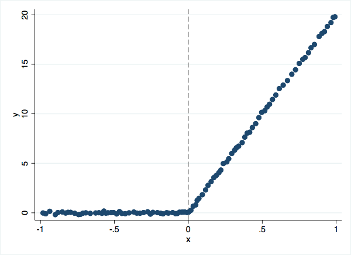
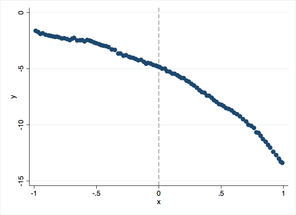

`rdpermute`: A permutation test for regression discontinuity and regression kink designs
==============
We present three examples of `rdpermute` used as a complement to standard RDD or RKD asymptotic tests.

**Example 1: RD**

Lee (2008) uses a regression discontinuity design with the vote share
margin as the running variable to estimate the effect of incumbency on likelihood of
winning the next election. This plot provides visual evidence that a Democrat winning
an election discretely increases the probability a Democrat will win the next election.

```{s}
    cap ssc install rdpermute
    cap ssc install binscatter
    use example_data/lee_election, clear
    binscatter y x, line(none) ytitle(Democrat Win Next Election) xtitle(Democratic Vote Share) nquant(100) rd(0)
    graph export lee.png, width(500) replace
```


To conduct the permutation test, we take the data as given and treat the
discontinuity point as a random variable. We calculate the RD coefficient at a
given set of placebo discontinuities, which are different values of the Democratic vote share.
We compare the estimates at these placebos to the estimate at the true discontinuity.
We specify the following options:

* `placebo_disconts(-50(1)49)` means we use 100 placebo discontinuities from -50 through 49
* `true_discont(0)` means the true discontinuity is at 0
* `deriv_discont(0)` means we are looking for a change in the intercept
* `linear` means we are using a local linear regression

```{s}
    rdpermute y x, placebo_disconts(-50(1)49) true_discont(0) deriv_discont(0) linear
```
The conclusions from the asymptotic and permutation tests coincide: under both
methodologies we reject the null hypothesis that incumbency does not affect future
election victory.

**Example 2: RK with kink**

Here we simulate data with an obvious kink at 0.

```{s}
    use "example_data/sim1", clear
    binscatter y x, line(none) nquant(100) rd(0)
    graph export sim1.png, width(500) replace
```



We specify the following options:

* `placebo_disconts(-.98(.02)1)` means we use 100 placebo kinks from -.98 through 1
* `true_discont(0)` means the true discontinuity is at 0
* `linear` means we are using a local linear regression

The default for `deriv_discont(1)` means we are looking for a change in the slope.

```{s}
    rdpermute y x, placebo_disconts(-.98(.02)1) true_discont(0) linear
```
The conclusions from the tests agree: both show highly significant slope changes at the policy kink point.


**Example 3: RK without kink**

In this example, we generate data with curvature around the kink point. In such cases,
misspecification of the functional form can lead to spurious RKD coefficients.

```{s}
    use "example_data/sim2", clear
    binscatter y x, line(none) nquant(100) rd(0)
    graph export sim2.png, width(500) replace
```



We use the same specification as in example 2.

```{s}
    rdpermute y x, placebo_disconts(-.98(.02)1) true_discont(0) linear
```

The conclusions from the tests disagree. The asymptotic test for linear RKD rejects
the null hypothesis even though the underlying data-generating process features no
discontinuous slope changes. In contrast, the permutation test correctly detects no kink.

In each example, we used 100 evenly spaced placebos over the main support of the
running variable. For an extended discussion of the choice of placebo kink locations,
see section 3.3 of Ganong & J&auml;ger (2018).

**Citations:**

Ganong, P. & Jäger, S. (2018), "A Permutation Test for the Regression Kink Design", Journal of the American Statistical Association, 113:522, 494-504, DOI: (10.1080/01621459.2017.1328356)[10.1080/01621459.2017.132835]

Lee, D. S. (2008), “Randomized Experiments From Non-Random Selection in US House Elections,” Journal of Econometrics, 142, 675–697.
